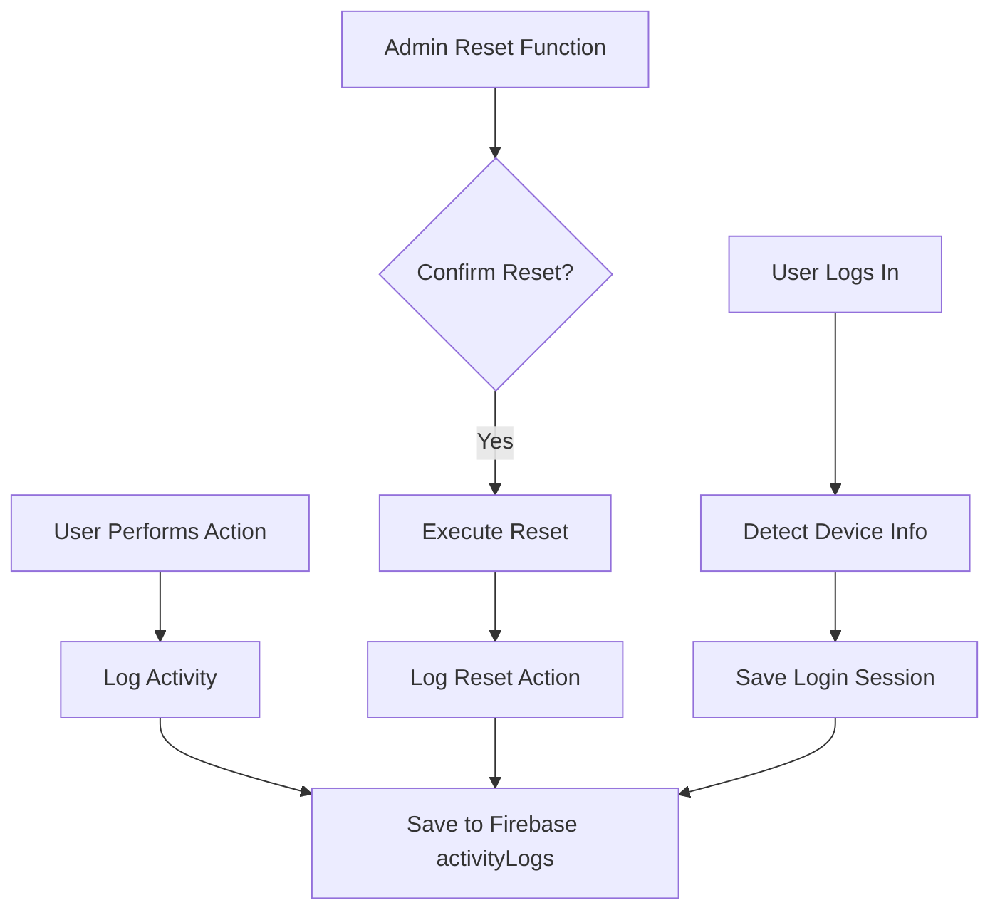

# Admin Reset Functions & Activity Logging System

## Overview
Add admin-only reset functions for data management and comprehensive activity logging to track all user actions with device information for monitoring and security purposes.

## Problem Statement
- No way for admin to reset erroneous daily data
- No audit trail of who did what and when
- No device tracking for login sessions
- Difficult to monitor user activities and detect suspicious behavior

## Solution Architecture



## 1. Activity Logging System

### Firebase Collection Structure

**New Collection: `activityLogs`**
```javascript
{
  "log_id_123": {
    // User Info
    userId: "user_uid",
    userName: "Juan Dela Cruz",
    userRole: "admin",
    
    // Action Info
    action: "payment_recorded",
    actionCategory: "financial",  // financial, repair, user, system, admin
    timestamp: "2025-12-28T10:30:00Z",
    
    // Device Info
    device: {
      browser: "Chrome 120",
      os: "Windows 10",
      deviceType: "Desktop",
      userAgent: "Mozilla/5.0...",
      screenResolution: "1920x1080",
      language: "en-US"
    },
    
    // Action Details
    details: {
      repairId: "repair_123",
      customerName: "Pedro Santos",
      amount: 1500,
      method: "Cash",
      // ... other relevant data
    },
    
    // Location (if available)
    ipAddress: "203.xxx.xxx.xxx",  // Optional
    
    // Result
    success: true,
    errorMessage: null
  }
}
```

### Actions to Log

#### Financial Actions
- `payment_recorded` - Payment recorded
- `payment_verified` - Payment verified
- `payment_deleted` - Payment deleted
- `expense_recorded` - Expense recorded
- `expense_deleted` - Expense deleted
- `day_locked` - Daily cash count locked
- `day_unlocked` - Daily cash count unlocked
- `remittance_submitted` - Remittance submitted
- `remittance_verified` - Remittance verified

#### Repair Actions
- `repair_created` - Device received
- `repair_accepted` - Repair accepted by tech
- `repair_completed` - Repair completed
- `repair_released` - Device released to customer
- `repair_deleted` - Repair deleted
- `diagnosis_created` - Diagnosis created
- `diagnosis_approved` - Customer approved pricing

#### User Actions
- `user_login` - User logged in
- `user_logout` - User logged out
- `user_created` - New user created
- `user_modified` - User info modified
- `user_deleted` - User deleted

#### System Actions
- `data_reset` - Admin reset data
- `backup_created` - Backup created
- `settings_changed` - System settings changed

### Device Detection Function

**File: `js/utils.js`**

```javascript
function getDeviceInfo() {
    const ua = navigator.userAgent;
    
    // Detect browser
    let browser = "Unknown";
    if (ua.includes("Chrome")) browser = "Chrome";
    else if (ua.includes("Firefox")) browser = "Firefox";
    else if (ua.includes("Safari")) browser = "Safari";
    else if (ua.includes("Edge")) browser = "Edge";
    else if (ua.includes("Opera")) browser = "Opera";
    
    // Detect OS
    let os = "Unknown";
    if (ua.includes("Windows NT 10")) os = "Windows 10/11";
    else if (ua.includes("Windows NT 6.3")) os = "Windows 8.1";
    else if (ua.includes("Windows NT 6.2")) os = "Windows 8";
    else if (ua.includes("Windows NT 6.1")) os = "Windows 7";
    else if (ua.includes("Mac OS X")) os = "macOS";
    else if (ua.includes("Android")) os = "Android";
    else if (ua.includes("iOS")) os = "iOS";
    else if (ua.includes("Linux")) os = "Linux";
    
    // Detect device type
    let deviceType = "Desktop";
    if (/Mobile|Android|iPhone|iPad|iPod/.test(ua)) {
        deviceType = "Mobile";
    } else if (/Tablet|iPad/.test(ua)) {
        deviceType = "Tablet";
    }
    
    return {
        browser: browser,
        os: os,
        deviceType: deviceType,
        userAgent: ua,
        screenResolution: `${window.screen.width}x${window.screen.height}`,
        language: navigator.language
    };
}
```

### Logging Function

**File: `js/repairs.js`**

```javascript
async function logActivity(action, actionCategory, details = {}) {
    try {
        const log = {
            userId: window.currentUser.uid,
            userName: window.currentUserData.displayName,
            userRole: window.currentUserData.role,
            action: action,
            actionCategory: actionCategory,
            timestamp: new Date().toISOString(),
            device: utils.getDeviceInfo(),
            details: details,
            success: true,
            errorMessage: null
        };
        
        await db.ref('activityLogs').push(log);
        console.log('✅ Activity logged:', action);
    } catch (error) {
        console.error('❌ Error logging activity:', error);
        // Don't fail the main action if logging fails
    }
}
```

### Login Session Tracking

**File: `js/auth.js`**

Update login function to log device info:

```javascript
async function handleLogin(email, password) {
    try {
        // ... existing login code ...
        
        // Log login with device info
        await logActivity('user_login', 'user', {
            email: email,
            loginTime: new Date().toISOString()
        });
        
        // Save current session
        window.currentSession = {
            loginTime: new Date().toISOString(),
            device: utils.getDeviceInfo()
        };
        
    } catch (error) {
        // ... error handling ...
    }
}
```

## 2. Admin Reset Functions

### Reset Options for Admin

#### A. Reset Today's Transactions
**Function: `resetTodayTransactions()`**

Options:
1. Reset Payments Only
2. Reset Expenses Only  
3. Reset Both (Full Reset)

**Safety:**
- Admin only
- Requires confirmation with password re-entry
- Cannot reset locked days
- Creates backup before reset
- Logs the reset action

#### B. Delete Specific Transaction
**Function: `deleteTransaction(type, id)`**

- Delete individual payment
- Delete individual expense
- Requires reason
- Logs deletion

#### C. Force Unlock Day
**Function: `forceUnlockDay(dateString)`**

- Already implemented
- Admin can unlock any locked day
- Requires reason
- Logs unlock

### UI: Admin Tools Panel

**Location: New tab "⚙️ Admin Tools" (Admin only)**

```
┌─────────────────────────────────────────┐
│ ⚙️ Admin Tools & Data Management        │
└─────────────────────────────────────────┘

┌─────────────────────────────────────────┐
│ 🔧 DATA RESET FUNCTIONS                 │
│                                          │
│ ⚠️ WARNING: These actions are           │
│ irreversible. Use with caution.         │
│                                          │
│ [Reset Today's Payments]                │
│ [Reset Today's Expenses]                │
│ [Full Reset - Today]                    │
│                                          │
│ Date Selector: [____]                   │
│ [Reset Selected Date]                   │
└─────────────────────────────────────────┘

┌─────────────────────────────────────────┐
│ 📊 ACTIVITY LOGS                        │
│                                          │
│ Filter by:                              │
│ User: [All Users ▼]                     │
│ Action: [All Actions ▼]                 │
│ Date: [Last 7 days ▼]                   │
│                                          │
│ [View Activity Logs]                    │
└─────────────────────────────────────────┘

┌─────────────────────────────────────────┐
│ 👥 ACTIVE SESSIONS                      │
│                                          │
│ Currently logged in users:              │
│ • Juan (Admin) - Chrome/Windows         │
│ • Maria (Cashier) - Mobile/Android      │
│ • Pedro (Tech) - Chrome/Windows         │
└─────────────────────────────────────────┘
```

### Reset Confirmation Dialog

```
┌─────────────────────────────────────────┐
│ ⚠️ CONFIRM DATA RESET                   │
│                                          │
│ You are about to:                        │
│ RESET TODAY'S PAYMENTS                  │
│                                          │
│ This will DELETE:                        │
│ • 5 payment records                     │
│ • Total amount: ₱2,500.00               │
│                                          │
│ ⚠️ THIS CANNOT BE UNDONE!               │
│                                          │
│ Enter your password to confirm:          │
│ [________________]                       │
│                                          │
│ Reason (required):                       │
│ [________________________________]       │
│                                          │
│ [Cancel] [⚠️ CONFIRM RESET]             │
└─────────────────────────────────────────┘
```

## 3. Activity Log Viewer

### View Logs Interface

**Location: Admin Tools tab**

```
┌─────────────────────────────────────────────────────────────┐
│ 📊 Activity Logs                                            │
│                                                             │
│ Showing 50 most recent activities                          │
├─────────────────────────────────────────────────────────────┤
│ Time              User        Action           Details      │
├─────────────────────────────────────────────────────────────┤
│ Dec 28, 10:30 AM  Juan (A)   Payment          ₱1,500       │
│                              Recorded          Pedro Santos │
│                              Chrome/Windows                 │
├─────────────────────────────────────────────────────────────┤
│ Dec 28, 10:25 AM  Maria (C)  Payment          ₱500         │
│                              Verified          Juan Cruz    │
│                              Mobile/Android                 │
├─────────────────────────────────────────────────────────────┤
│ Dec 28, 10:20 AM  Pedro (T)  Expense          ₱200         │
│                              Recorded          Delivery     │
│                              Chrome/Windows                 │
├─────────────────────────────────────────────────────────────┤
│ Dec 28, 10:15 AM  Juan (A)   Day Locked       Dec 27, 2025 │
│                              Chrome/Windows                 │
└─────────────────────────────────────────────────────────────┘
```

### Export Logs

- Export to CSV
- Export to Excel
- Filter by date range, user, action type
- Download for external analysis

## 4. Integration Points

### Update Existing Functions

Add `logActivity()` calls to:

1. **Payment Functions**
   - `savePayment()` → Log payment_recorded
   - `verifyPayment()` → Log payment_verified

2. **Expense Functions**
   - `saveExpense()` → Log expense_recorded

3. **Repair Functions**
   - `submitReceiveDevice()` → Log repair_created
   - `acceptRepair()` → Log repair_accepted
   - `completeRepair()` → Log repair_completed

4. **Cash Count Functions**
   - `lockDailyCashCount()` → Log day_locked
   - `unlockDailyCashCount()` → Log day_unlocked

5. **Auth Functions**
   - Login → Log user_login
   - Logout → Log user_logout

## 5. Implementation Steps

### Phase 1: Logging Infrastructure
1. Add `getDeviceInfo()` to utils.js
2. Add `logActivity()` to repairs.js
3. Create `activityLogs` collection in Firebase
4. Add logging to auth functions

### Phase 2: Integrate Logging
1. Add logs to payment functions
2. Add logs to expense functions
3. Add logs to repair functions
4. Add logs to cash count functions
5. Test logging on all actions

### Phase 3: Admin Reset Functions
1. Create reset functions in repairs.js
2. Add password confirmation
3. Add backup before reset
4. Add reset logging
5. Test reset functions

### Phase 4: Admin UI
1. Create Admin Tools tab (admin only)
2. Build reset interface
3. Build activity log viewer
4. Add filters and search
5. Add export functionality

### Phase 5: Active Sessions
1. Track login sessions
2. Display active users
3. Add session timeout
4. Add force logout (admin)

## 6. Security Considerations

1. **Admin Only** - All reset functions restricted to admin role
2. **Password Confirmation** - Require password for critical actions
3. **Cannot Delete Logs** - Activity logs are write-only
4. **Cannot Reset Locked Days** - Locked days cannot be reset
5. **Backup Before Reset** - Auto-backup before any reset
6. **Reason Required** - All resets must include a reason
7. **Rate Limiting** - Prevent rapid reset attempts

## 7. Files to Modify

1. **js/utils.js** - Add `getDeviceInfo()`
2. **js/repairs.js** - Add `logActivity()` and reset functions
3. **js/auth.js** - Add login logging
4. **js/ui.js** - Add Admin Tools tab
5. **js/app.js** - Load activity logs on init

## 8. Benefits

✅ **Complete Audit Trail** - Track every action  
✅ **Device Tracking** - Know who logged in from where  
✅ **Security Monitoring** - Detect suspicious activity  
✅ **Admin Control** - Reset erroneous data safely  
✅ **Accountability** - Clear responsibility for actions  
✅ **Compliance** - Meet audit requirements  
✅ **Troubleshooting** - Debug issues by reviewing logs

## 9. Example Log Entries

```javascript
// Payment logged
{
  action: "payment_recorded",
  userName: "Juan Dela Cruz",
  device: {browser: "Chrome", os: "Windows 10"},
  details: {amount: 1500, method: "Cash"}
}

// Reset logged
{
  action: "data_reset",
  userName: "Admin User",
  device: {browser: "Chrome", os: "Windows 10"},
  details: {
    resetType: "payments",
    date: "2025-12-28",
    itemsDeleted: 5,
    totalAmount: 2500,
    reason: "Duplicate entries"
  }
}

// Login logged
{
  action: "user_login",
  userName: "Maria Santos",
  device: {
    browser: "Chrome",
    os: "Android",
    deviceType: "Mobile"
  }
}
```

---

**This provides complete monitoring and admin control over the system!**

